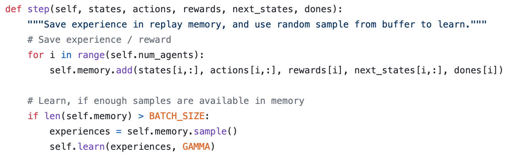

# Deep Reinforcement Learning Nanodgree 
## Project on Collaboration and Competition

### Project Description


In this project, we will work with [Tennis](https://github.com/Unity-Technologies/ml-agents/blob/master/docs/Learning-Environment-Examples.md#tennis) environment, in which two agents control rackets to bounce a ball over a net. If an agent hits the ball over the net, it receives a reward of +0.1. If an agent lets a ball hit the ground or hits the ball out of bounds, it receives a reward of -0.01. Thus, the goal of each agent is to keep the ball in play. 

It is to be noted that while there are two agents in the environment, they are not competing against each other (i.e., it is not like a real tennis game where a player aims to hit the ball out of bound of the other player). Instead, the two agents will learn from each other to keep the ball in play as long as possible. 

The task is episodic, and in order to solve the environment, the agents must get an average score of +0.5 (over 100 consecutive episodes, after taking the maximum over both agents). Specifically,

 * After each episode, we add up the rewards that each agent received (without discounting), to get a score for each agent. This yields 2 (potentially different) scores. We then take the maximum of these 2 scores.
 * This yields a single score for each episode.

The environment is considered solved, when the average (over 100 episodes) of those scores is at least +0.5.

In this project, we use an actor-critic algorithm, the Deep Deterministic Policy Gradients (DDPG) algorithm to train the agents. We implement the algorithm with a multi-agent approach to achieve the goal.

### Environment Description

The observation (state) space consists of 8 variables corresponding to the position and velocity of the ball and racket. The position is represented by a two values, leading to a total of 24 values in the state vector. Each agent receives its own, local observation. Two continuous actions are available, corresponding to movement toward (or away from) the net, and jumping. 

### Actor and Critic Networks

We define the Actor and Critic networks with fully-connected layers. Except the input and output layers, the networks have 3 hidden layers. The detailed architecture of the Actor and Critic networks is as follows:

#### Actor network

Input layer: 24 nodes (corresponding to 24 variables of the state of the environment)

Hidden layer 1: 256 nodes

Hidden layer 2: 128 nodes

Hidden layer 3: 64 nodes

Output layer: 2 nodes (corresponding to the number of entries in the action vector of the agent)

#### Critic network

Input layer: 26 nodes (corresponding to 24 variables of the state of the environment and 2 variables of the action)

Hidden layer 1: 256 nodes

Hidden layer 2: 128 nodes

Hidden layer 3: 64 nodes

Output layer: 1 node (corresponding the Q-value)

We note that betwen hidden layer 1 and hidden layer 2 of both networks, we add a batch normalization layer to standardizes the inputs to hidden layer 2 for each mini-batch. This helps further stabilize the learning process since activations can vary a lot due to fluctuating values of input state. For the Critic network, rather than concatenating the state and action before feeding to hidden layer 1, we first feed the state to hidden layer 1 and then concatenate the output of hidden layer 1 with the action to feed in hidden 2. It is also to be noted that hidden layer 3 for the Actor network is randomly initialized in the range (-0.003, 0.003). This allows us to avoid getting 1 or -1 output values in the initial stages, which would squash our gradients to zero, as we use the `tanh` activation for the output layer.

The implementation of the Actor and Critic networks is presented in `model.py`.

### Learning Algorithm

Since the action of the agent is continuous, we adopt Deep Deterministic Policy Gradient (DDPG) algorithm, which is a model-free off-policy algorithm to train the agent. DDPG combines the ideas of DPG (Deterministic Policy Gradient) and DQN (Deep Q-Network) in which Actor and Critic, each having two neural networks: a regular (local) network and a target network. The target networks are actually the copies of the regular networks but slowly learns, thus improving the stability in training. The code snippet below presents the declaration of the Actor and Critic networks with local and target versions separately.

```python
# Local and Target Networks of the Actor
self.actor_local = Actor(state_size, action_size, random_seed).to(device)
self.actor_target = Actor(state_size, action_size, random_seed).to(device)
self.actor_optimizer = optim.Adam(self.actor_local.parameters(), lr=LR_ACTOR)
        
# Local and Target Networks of the Critic
self.critic_local = Critic(state_size, action_size, random_seed).to(device)
self.critic_target = Critic(state_size, action_size, random_seed).to(device)
self.critic_optimizer = optim.Adam(self.critic_local.parameters(), lr=LR_CRITIC, weight_decay=WEIGHT_DECAY)
```

In this algorithm, The Actor network is used to determine the action given a state while the Critic network is used to estimate the Q-value for a pair of (`state, action`). We note that unlike the Advantage Actor-Critic, DDPG directly maps a `state` to the best `action` rather than providing the probability distribution across a discrete action space. This reduces the effort to discretize the action space, which is continuous in this project. The below figure presents the pseudo-codes of the DDPG algorithm (Image taken from “Continuous Control With Deep Reinforcement Learning” (Lillicrap et al., 2015)). The below sections present some details of the learning algorithm such as experience replay, updating the actor and critic network as well as the method how the agent explores new possible actions.


#### Experience Replay

Since DDPG adopts DQN, it also uses a replay buffer, which is a finite-sized memory (we have set the size of the reppay buffer to 100000) to store all the experience tuples (`state, action, reward, next_state`). As there are two agents in the game, at every step, there will be two sets of values of experience tuples that will be added to the experience buffer. At the learning step, the algorithm randomly samples a mini-batch from the replay buffer to update the value and policy networks. In the code, we have set the mini-batch size to 128. The function below shows the steps how the agent manages the experience buffer.



It is worth recalling that experience replay helps to break the temporal/chronological correlation among state/action pairs in each training episode. Without experience replay, this correlation could lead to instability (oscillation or divergence of Q-Values) during training as small updates to Q-values may significantly change the policy.

#### Updating parameters of actor and critic networks

Given the mini-batch of experience, the DDPG algorithm updates the parameters of the local actor and critic networks using backpropagation. As shown in the algorithm pseudocode above, the loss function used to update the local critic network is a mean square error between the Q-value obtained by the target critic network and the expected Q-value obtained by the local critic network. When implementing the parameter update, we have used gradient clipping to set an upper bound of the gradients so as to avoid the issue of gradient exploding. 

The parameters of the local actor network are updated similarly using a different loss function: 

#### Exploration 

Similar to other reinforcement learning algorithms, the agent trained with DDPG also explores the environment by selecting random actions rather than always using the best action it has learned. For discrete action spaces, exploration is done using epsilon-greedy that probabilistically selects a random action. For continuous action spaces, exploration is done by adding noise to the action itself. The original DDPG algorithm uses Ornstein-Uhlenbeck Process to generate noise and add to the action. We keep using this approach in this project. Nevertheless, recent literature (see the references [1,2]) stated that this can also be done by using a Gaussian process. We keep this adoption of Gaussian process for noise generation for future work.  

#### Future Directions

As mentioned in the exploration section, noise generation has been done by using Ornstein-Uhlenbeck Process. It would be interesting to implement the Gaussian process and validate this approach in compared with Ornstein-Uhlenbeck Process. 

It is also interesting to implement more advanced algorithms and compared their performance with DDPG. With continuous action space, we can implement the following algorithms to sove this problem.

* Distributed Distributional Deterministic Policy Gradients [2]
* Asynchorous Methods for Deep Reinforcement Learning [3]
* Proximal Policy Optimization Algorithms [4]

#### References

[1] https://arxiv.org/pdf/1802.09477.pdf

[2] https://arxiv.org/pdf/1804.08617.pdf

[3] https://arxiv.org/abs/1602.01783

[4] https://arxiv.org/abs/1707.06347
